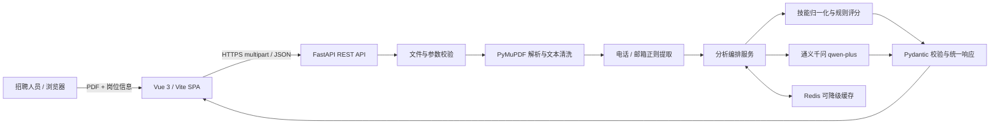
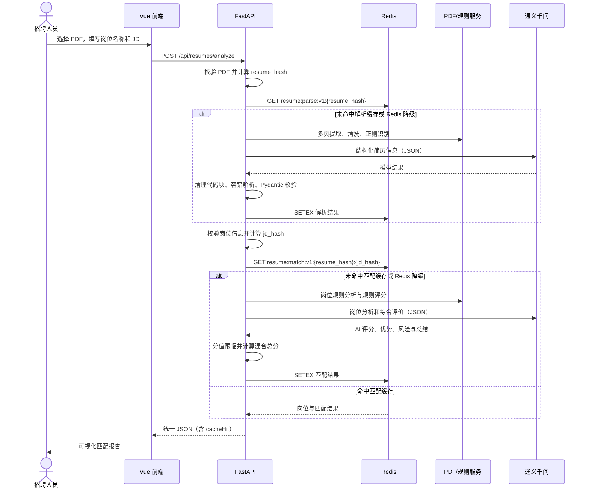

# AI 赋能智能简历分析系统

一个面向招聘初筛场景的全栈示例：上传单份文本型 PDF 简历，输入岗位名称与岗位描述（JD），系统会提取结构化候选人信息、分析岗位要求，并以“可复现规则分 + AI 评价分”生成匹配报告。

> 本仓库是工程演示与招聘辅助工具，不是自动录用或淘汰系统。上传内容会发送到所配置的 AI 服务；请先取得候选人授权，并避免上传无关敏感信息。

## 1. 项目介绍

系统以 FastAPI 提供 RESTful API，以 Vue 3 提供响应式单页界面。PDF 仅在请求期间以内存方式处理；PyMuPDF 提取文本后，正则规则优先识别电话和邮箱，通义千问负责结构化提取与语义评价。Redis 是可降级缓存：连接失败时记录脱敏 warning，但不阻断主流程。

适用场景包括岗位初筛演示、简历解析技术验证和 AI 应用工程实践。它不包含 ATS 全流程、候选人账号体系或企业级合规能力。

## 项目亮点

- 单接口完成 PDF 校验、多页提取、结构化简历抽取、JD 分析和匹配报告生成，前后端字段已经按真实接口联调。
- 规则与 AI 分工清晰：电话/邮箱及核心评分由确定性逻辑兜底，通义千问负责结构化语义抽取和仅占 10% 的辅助评价。
- 五维评分保留技能、经验、项目、学历与 AI 分项，并返回命中/缺失关键词、优势、风险和推荐等级，结果可解释、可复核。
- Redis 以 PDF/JD 内容哈希构造独立缓存，带 TTL；连接、鉴权或超时异常会安全降级，不阻断主业务。
- FastAPI 按 `api / core / schemas / services / prompts / utils` 分层，统一 Pydantic 契约、错误外壳与脱敏日志。
- Vue 3 页面覆盖拖放上传、双端文件校验、加载阶段、错误提示、结果可视化和移动端响应式布局。
- 提供 Docker、Compose、GitHub Actions、阿里云 FC、Vercel 与 GitHub Pages 的完整交付资料。

## 技术方案摘要

系统采用 Vue 3、Vite 与 Axios 构建响应式单页前端，以 FastAPI、Pydantic 和 Uvicorn 提供统一 REST API。后端先校验单个 PDF 的扩展名、MIME、文件头与大小，再由 PyMuPDF 逐页提取文本并完成 Unicode、空白和控制字符清洗。简历信息通过规则与通义千问协同抽取：电话、邮箱和已知技能以可复现规则优先，模型输出必须经过 JSON 容错解析、Pydantic 校验和原文证据约束。岗位侧提取核心/加分技能、学历、年限和职责，匹配侧以技能 40%、经验 20%、项目 20%、学历 10%、AI 10% 生成限幅总分，并保留解释字段。Redis 依据 PDF 与 JD 哈希分别缓存解析和匹配结果，异常时自动降级。项目提供统一异常处理、隐私提示、自动化测试、Docker 镜像和云端部署手册，适合作为可审计的招聘辅助工程演示，而非自动录用决策系统。

## 2. 在线演示地址

- 前端演示：`https://your-project.vercel.app`（占位，尚未真实部署）
- 后端健康检查：`https://your-fc-domain.example.com/api/health`（占位，尚未真实部署）

## 3. GitHub 仓库地址

`https://github.com/<your-account>/ai-resume-analyzer`（占位；推送前请替换账号并确认仓库中不含密钥或真实简历）

## 4. 功能清单

- 校验扩展名、MIME、PDF 文件头和默认 10 MB 大小上限；支持多页文本型 PDF。
- 清洗换行、不可见字符、连续空格和多余空行，不将上传文件永久落盘。
- 正则与 AI 协同提取基本信息、教育、工作、项目、技能、证书等结构化字段。
- 解析岗位核心技能、加分技能、学历、年限、职责、行业方向和其他要求。
- 处理 Spring Boot/SpringBoot、JavaScript/JS、Kubernetes/K8s 等技能别名。
- 以规则评分和 AI 综合评价混合计算总分，并将所有分值约束在 0～100。
- 返回命中/缺失关键词、优势、风险、总结、推荐等级以及缓存命中状态。
- Redis 不可用时自动降级；统一响应、全局异常处理、脱敏日志和 AI 超时控制。
- Vue 单页支持拖放上传、前端校验、示例 JD、阶段提示、错误展示和响应式结果面板。
- pytest 覆盖核心规则，Vitest 覆盖前端响应契约与表单策略；GitHub Actions 自动执行测试与构建。

## 5. 系统架构图



详细的组件边界、信任边界和降级策略见 [docs/architecture.md](docs/architecture.md)。

## 6. 主流程时序图



## 7. 技术选型

| 层级 | 技术 | 用途 |
| --- | --- | --- |
| 前端 | Vue 3、Vite、Axios | 单页交互、构建和 API 请求 |
| API | Python 3.10+、FastAPI、Uvicorn、Pydantic | REST 接口、校验、异步服务 |
| PDF | PyMuPDF | 多页文本提取 |
| AI | 阿里云百炼通义千问（默认 `qwen-plus`）、httpx | 结构化提取与语义评价 |
| 缓存 | Redis | 解析与岗位匹配缓存，可降级 |
| 测试 | pytest / FastAPI TestClient | 接口与领域规则测试 |
| 交付 | Docker、Compose、GitHub Actions | 本地容器和持续集成 |
| 云端 | 阿里云函数计算 FC、Vercel / GitHub Pages | 后端与前端部署方案 |

## 8. 项目目录

```text
ai-resume-analyzer/
├── backend/                 # FastAPI 应用、领域服务、Prompt、测试
├── frontend/                # Vue 3 单页应用
├── docs/
│   ├── architecture.md      # 架构、数据流与安全边界
│   ├── api-examples.md      # curl 和响应示例
│   ├── deployment.md        # 本地、FC、Vercel、Pages 部署手册
│   ├── review-report.md     # 代码审查、评分与精确修复清单
│   └── acceptance-checklist.md # 逐项验收状态与证据
├── .github/workflows/ci.yml # 后端测试 + 前端构建
├── docker-compose.yml       # 后端 + Redis
├── Makefile                 # 常用本地命令（可选）
├── .gitignore
├── LICENSE
└── README.md
```

后端内部按 `api / core / schemas / services / prompts / utils` 分层；路由只负责协议适配，业务编排和外部依赖分别放在服务层。

## 9. 本地启动方式

前置条件：Python 3.10+（推荐 3.11/3.12）、Node.js 18+（推荐 20）、npm；如启用缓存还需 Redis 7+。

```bash
git clone https://github.com/<your-account>/ai-resume-analyzer.git
cd ai-resume-analyzer

cd backend
python -m venv .venv
# macOS / Linux: source .venv/bin/activate
# Windows PowerShell: .venv\Scripts\Activate.ps1
python -m pip install -r requirements.txt
cp .env.example .env            # Windows 可用 Copy-Item .env.example .env
# 编辑 .env；需要完整 AI 能力时配置 DASHSCOPE_API_KEY
uvicorn app.main:app --reload --host 0.0.0.0 --port 8000
```

另开终端启动前端：

```bash
cd frontend
cp .env.example .env            # Windows 可用 Copy-Item .env.example .env
npm install
npm run dev
```

访问 `http://localhost:5173`；API 文档位于 `http://localhost:8000/docs`。若不想使用 Redis，将 `REDIS_ENABLED=false`，主流程仍可运行。未配置 AI Key 时后端以确定性规则模式运行；结构化语义提取和 AI 综合评价需有效的百炼 Key。

## 10. 环境变量说明

后端变量以 [backend/.env.example](backend/.env.example) 为准：

| 变量 | 默认/示例 | 说明 |
| --- | --- | --- |
| `APP_NAME` | `AI Resume Analyzer` | 应用名称 |
| `APP_ENV` | `development` | 运行环境 |
| `DEBUG` | `false` | 调试开关；生产必须关闭 |
| `PORT` | `8000` | 服务监听端口 |
| `DASHSCOPE_API_KEY` | 无 | 百炼 API Key，禁止提交到 Git |
| `DASHSCOPE_MODEL` | `qwen-plus` | 模型名称 |
| `DASHSCOPE_TIMEOUT` | `60` | AI 请求超时（秒） |
| `DASHSCOPE_BASE_URL` | 百炼兼容接口 | 后端实际请求的 Chat Completions 完整地址（如示例文件提供） |
| `REDIS_ENABLED` | `true` | 是否启用缓存 |
| `REDIS_HOST` / `REDIS_PORT` | `localhost` / `6379` | Redis 地址 |
| `REDIS_PASSWORD` / `REDIS_DB` | 空 / `0` | Redis 鉴权和数据库 |
| `REDIS_TTL` | `86400` | 缓存 TTL（秒） |
| `MAX_UPLOAD_SIZE_MB` | `10` | PDF 大小上限 |
| `MAX_PDF_PAGES` | `50` | PDF 最大页数；在逐页提取前拒绝超限文件 |
| `RETURN_CLEANED_TEXT` | `false` | 是否在响应返回完整清洗文本；仅本地调试时显式开启 |
| `CORS_ORIGINS` | `http://localhost:5173` | 允许的前端 Origin；多个值的格式见示例文件 |

前端变量：

| 变量 | 本地默认 | 说明 |
| --- | --- | --- |
| `VITE_API_BASE_URL` | `http://localhost:8000` | 后端地址；生产必须替换为公网 HTTPS API |
| `VITE_BASE_PATH` | `/` | 静态站点基础路径；Pages 项目站点设为 `/<repository>/` |
| `VITE_DEV_PROXY_TARGET` | `http://127.0.0.1:8000` | 仅供 Vite 本地代理使用 |

Vite 的 `VITE_*` 变量会进入浏览器构建产物，绝不能放密钥。

## 11. Docker 启动方式

在仓库根目录创建本地 `.env`（可只写 `DASHSCOPE_API_KEY=...`，该文件已忽略），然后执行：

```bash
docker compose config
docker compose up --build
```

Compose 启动 `backend` 和 `redis`，分别映射到 `8000` 和 `6379`。Redis 关闭 RDB/AOF，避免本地缓存持久落盘；停止并清理：

```bash
docker compose down
```

健康检查：`curl http://localhost:8000/api/health`。本 Compose 不负责前端热更新，前端继续运行 `npm run dev`；生产环境前端应独立部署。

## 12. API 接口说明

| 方法 | 路径 | Content-Type | 作用 |
| --- | --- | --- | --- |
| GET | `/api/health` | — | 健康检查 |
| POST | `/api/resumes/parse` | `multipart/form-data` | 校验并解析单份 PDF，提取结构化信息 |
| POST | `/api/resumes/match` | `application/json` | 依据 `resumeId`、岗位名称和 JD 计算匹配度 |
| POST | `/api/resumes/analyze` | `multipart/form-data` | 前端主接口，一次完成解析、提取、岗位分析与评分 |

所有接口使用统一外壳：成功为 `{"code": 200, "message": "...", "data": {...}}`，失败为 `{"code": 4xx/5xx, "message": "可读错误", "data": null}`，同时设置正确 HTTP 状态码。字段的当前权威定义以运行中的 `/docs` OpenAPI 页面为准。

## 13. 请求和响应示例

```bash
curl -X POST "http://localhost:8000/api/resumes/analyze" \
  -F "file=@./resume.pdf;type=application/pdf" \
  -F "jobTitle=Python AI 应用工程师" \
  -F "jobDescription=负责 FastAPI 服务和大模型应用开发，要求 Python、Redis、Docker，3 年以上经验"
```

响应摘要示例（为便于阅读省略经历数组）：

```json
{
  "code": 200,
  "message": "分析成功",
  "data": {
    "resumeId": "sha256-derived-id",
    "pageCount": 2,
    "resume": {"basicInfo": {"name": "示例候选人", "phone": "13800000000", "email": "candidate@example.com"}},
    "match": {
      "overallScore": 82,
      "skillScore": 90,
      "experienceScore": 80,
      "projectScore": 75,
      "educationScore": 80,
      "aiScore": 80,
      "aiUsed": true,
      "analysisMode": "ai",
      "warnings": null,
      "matchedKeywords": ["python", "fastapi", "redis"],
      "missingKeywords": ["kubernetes"],
      "recommendationLevel": "较为匹配"
    },
    "cacheHit": false
  }
}
```

示例字段会随实际 schema 调整，完整命令、错误示例和两段式调用见 [docs/api-examples.md](docs/api-examples.md)。

## 14. 简历评分算法

系统不把模型随意给出的单一分数直接作为结论。规则侧先得到四项分数，AI 仅占总分的 10%：

```text
overallScore = skillScore × 0.40
             + experienceScore × 0.20
             + projectScore × 0.20
             + educationScore × 0.10
             + aiScore × 0.10
```

- 技能分：岗位核心技能归一化后，按 `命中数 / 核心技能数 × 100` 计算；JD 未识别出核心技能时使用 60 分中性回退。加分技能当前只展示，不直接进入公式。
- 经验分：有明确年限要求时按 `实际年限 / 要求年限 × 100`（封顶 100）计算；缺失年限或 JD 无年限要求时使用可审计的固定回退规则。
- 项目分：从项目名称、角色、技术栈和描述中提取已知技能，再与岗位核心技能计算重合度；缺失项目时采用保守回退。
- 学历分：有明确学历要求时按高中/专科/本科/硕士/博士层级比较；无要求或信息不足时使用固定回退，避免臆测。
- AI 分：基于已提取事实做综合相关性评价，不能补造候选人经历。

未配置 AI Key 或 AI 输出未通过结构校验时，`aiScore` 使用规则综合分（技能 45%、经验 25%、项目 20%、学历 10%），因此接口仍可在纯规则模式下给出确定性结果。响应同时返回 `aiUsed=false`、`analysisMode=rules` 和安全告警，前端明确显示“规则回退分”；只有有效 AI 评价真正进入公式时才返回 `aiUsed=true`。

后端对每项和总分统一执行 0～100 限幅。推荐等级为：85～100“高度匹配”、70～84“较为匹配”、50～69“一般匹配”、0～49“匹配度较低”。分数是排序线索而非录用结论。

## 15. 技能标准化策略

匹配前会执行 Unicode/大小写和空白标准化、无意义分隔符清理以及受控别名字典映射。例如：

| 输入变体 | 规范值 |
| --- | --- |
| `SpringBoot`、`Spring Boot` | `spring boot` |
| `JavaScript`、`JS` | `javascript` |
| `TypeScript`、`TS` | `typescript` |
| `PostgreSQL`、`Postgres` | `postgresql` |
| `Kubernetes`、`K8s` | `kubernetes` |
| `Artificial Intelligence`、`AI` | `artificial intelligence` |
| `Machine Learning`、`ML` | `machine learning` |

别名字典刻意保持可审计，并用词边界降低子串误判；但 `go`、`es` 等短缩写仍存在语境歧义，需要人工核验并持续收紧字典。关键词命中只说明文本证据存在，不等同于熟练度认证。

## 16. Redis 缓存设计

```text
resume_hash = SHA256(PDF 原始字节)
jd_hash     = SHA256(canonical JSON {jobTitle, jobDescription})

resume:parse:v1:{resume_hash}
resume:match:v1:{resume_hash}:{jd_hash}
```

默认 TTL 为 86400 秒。解析缓存减少同一 PDF 的重复提取和模型调用；匹配缓存同时绑定简历与 JD，避免岗位变化后误用旧结果。`/parse` 的 `cacheHit` 表示解析缓存命中，`/match`/`/analyze` 的最终 `cacheHit` 表示完整岗位匹配缓存命中；即使最终为 `false`，内部解析步骤仍可能已复用缓存。

Redis 操作全部可降级：超时、鉴权或连接失败只记录不含密码/简历正文的 warning 并继续分析。缓存命中值会先经过完整 Pydantic schema、简历哈希/ID 和岗位标题一致性校验；损坏或不兼容值安全视为 miss 并重算。缓存可能包含结构化简历信息，生产 Redis 必须使用私网、TLS/鉴权、最小权限和受控 TTL；如合规要求禁止缓存个人信息，请设置 `REDIS_ENABLED=false`。

Key 中的 `v1` 是缓存合同版本；schema、Prompt 或评分算法发生不兼容变化时必须升级 namespace。旧版无版本 Parse Key 只用于滚动部署期间的严格校验只读恢复，新请求不会命中或写入旧 namespace。

## 17. AI Prompt 设计

Prompt 按“简历结构化提取、岗位分析、匹配评价”拆分，避免一个超长 Prompt 承担所有责任。共同约束包括：

- 仅依据输入文本，禁止补全或虚构；不确定值返回 `null` 或空数组。
- 明确 JSON 字段和类型，要求只输出 JSON；服务端仍会清理 Markdown 代码块。
- 使用版本化系统约束与唯一边界包裹 JSON 数据，明确简历/JD 内的角色声明、伪造标签和“忽略指令”均是不可信文本，不得执行；边界标记会转义，并有 Prompt 注入回归测试。
- AI 输出经容错 JSON 解析、Pydantic 校验、字段默认值和分值限幅后才能进入响应。
- 电话和邮箱采用“正则提取 + AI 结果校验”，可靠正则结果优先。
- 设置固定超时；网络/鉴权失败和超时映射为可读的 502/504。非法 JSON 不会直接进入业务结果，能够安全降级的提取/评分路径回退到规则结果。

模型输出不是事实来源。生产中应记录 Prompt 版本、模型版本和质量指标（不记录简历全文），并用脱敏样本做回归评估。

## 18. 异常处理

| HTTP | 场景示例 |
| --- | --- |
| 400 | 空/过短 JD、伪 PDF、文件损坏、无可提取文本 |
| 404 | `resumeId` 不存在或对应解析缓存已过期 |
| 413 | 文件超过配置上限 |
| 422 | 请求字段或表单数据校验失败 |
| 500 | 未预期的内部错误（客户端不返回堆栈） |
| 502 | AI 服务网络失败、鉴权失败、非成功 HTTP 状态或上游响应外壳异常 |
| 504 | AI 服务请求超时 |

模型正文为非法 JSON 或未通过 Pydantic 校验时，当前实现丢弃该次 AI 输出并回退到规则结果，不返回 502。全局异常处理器保持统一响应格式。日志可记录路径、耗时、页数、缓存命中、AI 耗时、Redis 降级和错误类型，但不得记录完整简历、完整手机号/邮箱、API Key、Redis 密码或 Python 堆栈到客户端。

## 19. 阿里云 FC 部署

推荐使用“函数计算 FC 自定义容器 + 容器镜像服务 ACR”：构建 `backend/Dockerfile`，推送 Linux/amd64（或与 FC 配置一致架构）镜像，创建 Web 函数并把容器监听端口和函数端口统一为 `8000`，配置 HTTP 触发器与公网访问。

在 FC 环境变量中设置百炼、Redis、CORS、上传限制等配置；不要把 `.env` 打入镜像。`CORS_ORIGINS` 必须写实际 Vercel/Pages 域名，健康检查为 `/api/health`。百炼中国区 OpenAI 兼容地址为 `https://dashscope.aliyuncs.com/compatible-mode/v1`。完整的 ACR 命令、函数配置、日志和验收步骤见 [docs/deployment.md](docs/deployment.md)。

## 20. Vercel 部署

导入 GitHub 仓库后将 Root Directory 设为 `frontend`，Build Command 使用 `npm run build`，Output Directory 使用 `dist`，并设置生产变量：

```env
VITE_API_BASE_URL=https://<your-fc-public-domain>
```

前端提供 `vercel.json` 时应将 SPA 深链 rewrite 到 `/index.html`。部署完成后把 Vercel HTTPS 域名加入后端 `CORS_ORIGINS`，重新发布 FC，再进行上传分析验证。此仓库中的 URL 仍为占位，并不表示已经部署成功。

## 21. GitHub Pages 部署

Pages 是静态前端备选方案。仓库已提供 [`.github/workflows/pages.yml`](.github/workflows/pages.yml)，使用 GitHub 官方 `configure-pages`、`upload-pages-artifact`、`deploy-pages` Actions，自动设置 `VITE_BASE_PATH=/<repository>/` 并发布 `frontend/dist`。启用前必须在仓库 Variables 中设置公网 HTTPS `VITE_API_BASE_URL`；缺失或不是 HTTPS 时工作流会 fail-fast，避免发布无法调用后端的页面。

若应用使用 history 路由，应添加 404 回退或改用 hash 路由；当前单页也应实际测试刷新。Pages 为 HTTPS，后端必须是 HTTPS，否则浏览器会拦截混合内容。完整工作流示例见 [docs/deployment.md](docs/deployment.md)。

## 22. 测试方法

后端单元测试必须 Mock AI，且不依赖真实 Redis：

```bash
cd backend
pytest
```

前端契约测试与生产构建：

```bash
cd frontend
npm install
npm test
npm run build
```

容器配置与构建（本机安装 Docker 时）：

```bash
docker compose config
docker compose build
```

CI 在 push/PR 时分别运行 pytest 和 `npm ci && npm test && npm run build`，不会调用真实 AI。Pages 工作流也会先测试再部署。建议上线前另做一轮仅使用授权脱敏样本的 Redis/AI 集成测试。

2026-07-12 修复复验：后端 `56 passed`，前端 Vitest `9 passed`，Vite 生产构建 `76 modules transformed`，`docker compose config` 通过。基线镜像此前已构建并通过健康检查；本轮最终镜像重建因本机外部执行审批用量限制未获授权，提交前仍须手动执行 `docker compose build` 和容器健康检查，不能把基线结果冒充最终镜像结果。

## 23. 隐私和安全说明

- 上传的 PDF 不会作为业务文件长期保存，服务以内存处理；但结构化结果可能按 TTL 进入 Redis。
- 简历文本会发送到所配置的 AI 服务。使用者需获得候选人授权，并确认服务地域、数据处理条款和组织合规要求。
- 匹配结果只能作为招聘辅助，不应成为录用、淘汰、薪资或其他高影响决策的唯一依据；需要人工复核和申诉机制。
- `.env`、API Key、Redis 密码和真实简历不得提交到 Git。生产使用 FC 环境变量/密钥管理，限制管理权限并轮换密钥。
- 公网部署需使用 HTTPS、精确 CORS 白名单、请求大小/速率限制、访问日志脱敏、Redis 私网与鉴权；必要时增加登录授权、恶意文件检测和审计。
- SHA-256 是缓存标识而不是匿名化。简历哈希仍可能构成可关联标识，不应公开或无限期保留。
- `RETURN_CLEANED_TEXT` 安全默认值为 `false`；只有明确的本地调试需要才应开启。

## 24. 已知限制

- 当前核心能力只支持包含文本层的 PDF；扫描件、图片简历和复杂 OCR 未覆盖。
- 单文件默认限制 10 MB、50 页，岗位名称限制 120 字符、JD 限制 10～5000 字符；尚未实现独立解析进程、CPU 时间预算和恶意文件检测。
- 双栏、表格、图标化技能和特殊字体可能导致文本顺序或字段提取偏差。
- AI 可能误解、遗漏或输出不稳定；Pydantic 只能校验结构，不能证明语义真实。
- 规则关键词难以完整表达技能熟练度、迁移能力、职业间断等语境。
- `/match` 依赖解析缓存中的 `resumeId` 时，缓存过期后需重新解析；禁用 Redis 后，两段式 `/parse` → `/match` 在 FC 跨实例调用时也可能丢失进程内记录。前端主流程使用单次 `/analyze`，当前不是永久简历库。
- Redis 降级会增加模型调用时延和成本；单实例内存处理也受 FC 内存、超时和并发限制。
- 未内置账号、租户隔离、配额、病毒扫描、OCR、人工标注后台或招聘偏差审计。
- 占位演示地址和 GitHub 地址需要维护者自行部署/创建，仓库不声称真实云资源已完成。

## 25. 后续优化方向

- 接入受控 OCR 与版面分析，支持扫描件和复杂多栏简历，并增加质量置信度。
- 将现有 Prompt/缓存合同版本与模型、别名字典版本联动，并增加离线评测集和可解释的证据引用。
- 增加认证授权、租户隔离、限流、队列、幂等、恶意文件检测和安全审计。
- 引入加密 Redis、精细删除接口、保留策略和候选人数据访问/删除流程。
- 将评分权重配置化，按岗位族校准，并开展公平性、偏差和误伤率评估。
- 增加 OpenTelemetry 指标与链路追踪，只采集脱敏元数据。
- 加入组件级/端到端测试、无障碍检查、依赖扫描、镜像扫描和正式 CD 审批。

## GitHub 推送命令

先在 GitHub 创建空的公开仓库，确认 `git status` 不包含 `.env`、密钥、日志或真实 PDF，再执行：

```bash
git init
git add .
git status
git commit -m "feat: deliver AI resume analyzer"
git branch -M main
git remote add origin https://github.com/<your-account>/ai-resume-analyzer.git
git push -u origin main
```

若已有远端，请先核对 remote；不要盲目覆盖历史。公开前可使用 secret scanning 工具再检查一次。

## 最终验收清单

- [x] `GET /api/health` 返回统一成功结构，Swagger 可访问。
- [x] 合法多页文本 PDF 可解析；非 PDF、损坏、空文本、超 10 MB 或超 50 页均返回正确状态码。
- [x] 电话/邮箱正则优先，AI 非法 JSON/Schema 可控，来源透明，所有分值限制在 0～100。
- [x] 版本化缓存命中、损坏值回退和 Redis 故障降级已有自动化 fake 证据。
- [x] 前端能上传/移除 PDF、填写示例 JD、防重复提交、显示阶段和完整可视化结果。
- [x] 桌面端与移动端布局可用，错误状态清楚，不只展示原始 JSON。
- [x] `cd backend && pytest` 通过，测试未真实调用通义千问。
- [x] `cd frontend && npm install && npm test && npm run build` 通过，生产源码不含固定 API 地址或密钥。
- [ ] 本轮 `docker compose config` 已通过；需在本机审批恢复后重跑 `docker compose build` 与最终容器健康检查。
- [ ] FC 端口/环境变量/公网触发器/CORS/日志正确，公网 `/api/health` 实测通过。
- [ ] Vercel 或 Pages HTTPS 页面能访问 FC HTTPS API，刷新页面无明显路由错误。
- [ ] GitHub Actions 通过，仓库公开，README 的演示与仓库占位链接已替换。
- [ ] 日志、Git 历史、镜像和构建产物均不含真实简历、联系方式、API Key 或 Redis 密码。
- [ ] 招聘人员知晓人工复核义务，评分未作为唯一招聘决策依据。

逐项审查状态、证据与未完成项见 [docs/acceptance-checklist.md](docs/acceptance-checklist.md)，模拟评分和修复优先级见 [docs/review-report.md](docs/review-report.md)。

## 提交给招聘方的消息模板

```text
您好，我已完成“AI 赋能的智能简历分析系统”笔试项目。

GitHub 仓库：<替换为公开仓库地址>
线上演示地址：<替换为可访问的前端地址>

姓名：<填写姓名>
联系方式：<填写联系方式>

项目实现了 PDF 简历解析、AI 结构化信息提取、岗位需求分析、规则与 AI 混合匹配评分、Redis 可降级缓存和可视化前端页面。系统架构、评分算法、隐私边界、测试证据及阿里云 FC/Vercel 部署方式已整理在 README 与 docs 中，欢迎查阅。评分仅作为招聘辅助，结果需要人工复核。
```

## 提交前最终流程

1. 创建并确认 GitHub 公开仓库可匿名访问，替换 README 的仓库占位地址。
2. 部署阿里云 FC 后端，确认公网 HTTPS `/api/health` 返回 200。
3. 部署 Vercel 或 GitHub Pages 前端，替换 README 的演示占位地址。
4. 使用授权的文本型多页 PDF 与测试 JD 完成一次端到端分析。
5. 核对姓名、联系方式、岗位字段、五项评分、关键词、优势和风险展示。
6. 用桌面与移动视口检查页面，并确认浏览器控制台无错误。
7. 关闭或断开 Redis，确认主流程可降级；恢复后重复请求确认缓存命中。
8. 运行后端测试、前端构建、Compose 配置与镜像构建，并检查 CI 状态。
9. 扫描仓库、Git 历史、镜像和构建产物，确认没有真实密钥、`.env` 或真实简历。
10. 确认 README 中仓库、演示、联系方式均已替换，再向招聘方提交。

## License

[MIT](LICENSE)
