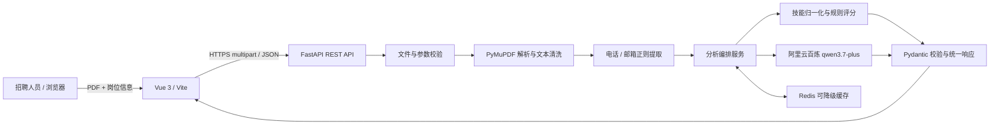
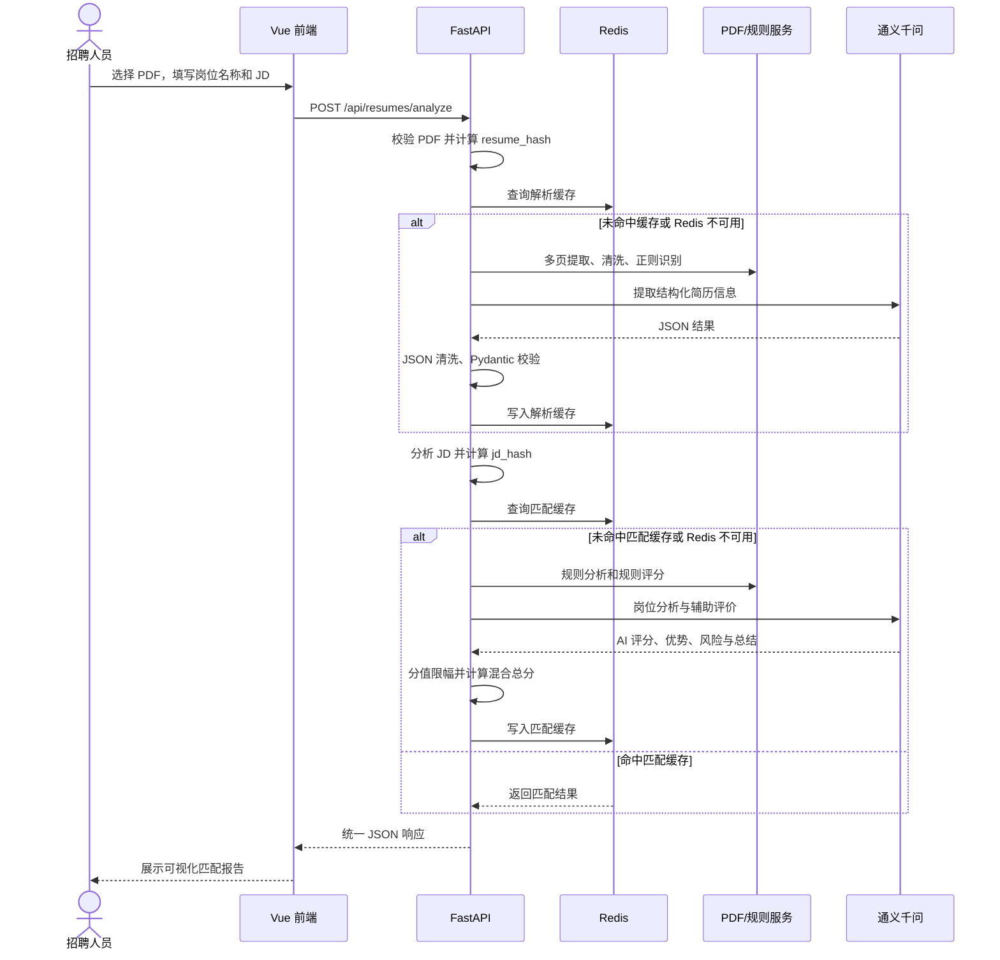

# AI 赋能智能简历分析系统

一个面向招聘初筛场景的全栈 AI 应用：上传单份文本型 PDF 简历，输入岗位名称与岗位描述（JD），系统会提取结构化候选人信息、分析岗位要求，并以“可复现规则评分 + AI 辅助评价”生成匹配报告。

> 本项目用于工程演示与招聘辅助，不是自动录用或淘汰系统。简历内容会发送到所配置的 AI 服务，请先取得候选人授权，并避免上传无关敏感信息。

## 1. 项目介绍

系统以 FastAPI 提供 RESTful API，以 Vue 3 提供响应式单页界面。PDF 仅在请求期间以内存方式处理，不会作为业务文件长期保存。PyMuPDF 负责提取多页文本，正则规则优先识别电话和邮箱，阿里云百炼通义千问负责结构化信息提取、岗位语义分析和辅助评价。

Redis 作为可降级缓存使用：连接失败、鉴权失败或请求超时时，系统会记录脱敏日志并继续完成主流程，不会因缓存服务不可用而导致简历分析失败。

适用场景包括：

- 招聘初筛演示
- PDF 简历解析技术验证
- AI 信息抽取与结构化输出实践
- 岗位匹配评分与可解释结果展示
- Serverless AI 应用工程实践

本项目不包含完整 ATS 流程、候选人账号体系、企业级租户隔离或正式招聘决策能力。

## 2. 项目亮点

- 单接口完成 PDF 校验、多页解析、信息提取、JD 分析和匹配报告生成。
- 规则与 AI 分工明确：电话、邮箱及核心评分由确定性逻辑兜底，AI 主要负责语义提取与辅助评价。
- 五维评分覆盖技能、经验、项目、学历和 AI 评价，并返回命中关键词、缺失关键词、优势、风险及推荐等级。
- 技能名称支持别名归一化，例如 SpringBoot / Spring Boot、JavaScript / JS、Kubernetes / K8s。
- Redis 使用 PDF 与 JD 内容哈希构造独立缓存，带 TTL 和版本化 Key，异常时自动降级。
- FastAPI 按 `api / core / schemas / services / prompts / utils` 分层，统一 Pydantic 契约、异常响应和脱敏日志。
- Vue 3 前端支持拖拽上传、文件校验、阶段提示、错误展示、评分可视化和移动端适配。
- 提供 Docker、Docker Compose、GitHub Actions、阿里云函数计算 FC 和 Vercel 部署配置。

## 3. 在线地址

- 前端演示：部署中
- 后端健康检查：部署中
- API 文档：部署中
- GitHub 仓库：<https://github.com/ZYZ666-RGB/ai-resume-analyzer>

部署完成后，将本节中的“部署中”替换为真实公网地址。

## 4. 核心功能

### 4.1 PDF 简历上传与解析

- 支持上传单个 PDF 文件
- 校验文件扩展名、MIME 类型和 PDF 文件头
- 默认文件大小限制为 10 MB
- 默认最大页数为 50 页
- 支持多页文本型 PDF
- 使用 PyMuPDF 提取文本
- 清洗不可见字符、连续空格和多余空行
- PDF 文件仅在内存中处理，不长期落盘
- 对损坏 PDF、无文本 PDF、伪 PDF 和超限文件返回明确错误

### 4.2 简历信息提取

系统通过“正则规则 + AI”协同提取：

- 姓名
- 电话
- 邮箱
- 地址
- 求职意向
- 期望薪资
- 工作年限
- 教育经历
- 工作经历
- 技能列表
- 项目经历
- 证书与荣誉

电话和邮箱优先使用正则结果；AI 输出必须经过 JSON 容错解析、Pydantic 校验和原文证据约束。

### 4.3 岗位描述分析

从岗位名称和 JD 中提取：

- 核心技能
- 加分技能
- 学历要求
- 工作年限要求
- 岗位职责
- 行业或业务方向
- 其他要求

### 4.4 简历匹配评分

系统采用“规则评分 + AI 辅助评价”：

- 技能匹配：40%
- 工作经验：20%
- 项目相关性：20%
- 学历匹配：10%
- AI 综合评价：10%

结果包含：

- 综合评分
- 分项评分
- 命中关键词
- 缺失关键词
- 候选人优势
- 潜在风险
- 综合评价
- 推荐等级
- 是否使用 AI
- 是否命中缓存

### 4.5 Redis 缓存

缓存以下结果：

- PDF 解析与简历信息提取结果
- 简历与岗位匹配结果

Redis 不可用时自动降级，不阻断主业务。

### 4.6 前端交互

- 点击或拖拽上传 PDF
- 显示文件名称和大小
- 文件类型和大小校验
- 岗位名称与 JD 输入
- 示例 JD 一键填充
- 分析阶段提示
- 防止重复提交
- 综合评分圆环
- 分项评分进度条
- 技能、经历、关键词、优势与风险展示
- 桌面端和移动端响应式布局

## 5. 系统架构



详细架构、数据流和安全边界见 [docs/architecture.md](docs/architecture.md)。

## 6. 主流程



## 7. 技术选型

| 层级 | 技术 | 用途 |
| --- | --- | --- |
| 前端 | Vue 3、Vite、Axios | 单页交互、构建和 API 请求 |
| 后端 | Python 3.10+、FastAPI、Uvicorn、Pydantic | REST 接口、参数校验和业务编排 |
| PDF | PyMuPDF | 多页 PDF 文本提取 |
| AI | 阿里云百炼 `qwen3.7-plus`、httpx | 信息提取、JD 分析和语义评价 |
| 缓存 | Redis | 解析与岗位匹配缓存，可降级 |
| 测试 | pytest、FastAPI TestClient、Vitest | 后端接口与前端契约测试 |
| 工程化 | Docker、Docker Compose、GitHub Actions | 容器化、持续集成和自动部署配置 |
| 云端 | 阿里云函数计算 FC、Vercel | 后端与前端部署 |

## 8. 项目目录

```text
ai-resume-analyzer/
├── backend/                   # FastAPI 应用、服务、Prompt 与测试
├── frontend/                  # Vue 3 单页应用
├── docs/
│   ├── architecture.md        # 架构、数据流与安全边界
│   ├── api-examples.md        # API 请求和响应示例
│   └── deployment.md          # 本地、FC、Vercel 与 Pages 部署说明
├── .github/
│   └── workflows/
│       ├── ci.yml             # 后端测试、前端测试与构建
│       └── pages.yml          # GitHub Pages 前端部署
├── docker-compose.yml         # 后端与 Redis
├── Makefile                   # 常用命令
├── .gitignore
├── LICENSE
└── README.md
```

后端内部按 `api / core / schemas / services / prompts / utils` 分层，路由只负责协议适配，业务编排和外部服务调用位于服务层。

## 9. 本地运行

### 9.1 环境要求

- Python 3.10+
- Node.js 18+
- npm
- Redis 7+（可选）

### 9.2 克隆项目

```bash
git clone https://github.com/ZYZ666-RGB/ai-resume-analyzer.git
cd ai-resume-analyzer
```

### 9.3 启动后端

Windows PowerShell：

```powershell
cd backend
python -m venv .venv
.\.venv\Scripts\python.exe -m pip install -r requirements.txt
Copy-Item .env.example .env
# 编辑 .env，填写 DASHSCOPE_API_KEY
.\.venv\Scripts\python.exe -m uvicorn app.main:app --host 127.0.0.1 --port 8000
```

macOS / Linux：

```bash
cd backend
python3 -m venv .venv
source .venv/bin/activate
python -m pip install -r requirements.txt
cp .env.example .env
# 编辑 .env，填写 DASHSCOPE_API_KEY
python -m uvicorn app.main:app --host 0.0.0.0 --port 8000
```

启动后访问：

- 健康检查：<http://127.0.0.1:8000/api/health>
- Swagger 文档：<http://127.0.0.1:8000/docs>

未配置有效 AI Key 时，系统会使用规则模式继续完成分析。

### 9.4 启动前端

```powershell
cd frontend
npm install
Copy-Item .env.example .env
npm run dev
```

访问：<http://localhost:5173>

前端 `.env` 默认配置：

```env
VITE_API_BASE_URL=http://127.0.0.1:8000
```

## 10. 环境变量

### 10.1 后端

以后端 [`.env.example`](backend/.env.example) 为准：

| 变量 | 默认/示例 | 说明 |
| --- | --- | --- |
| `APP_NAME` | `AI Resume Analyzer` | 应用名称 |
| `APP_ENV` | `development` | 运行环境 |
| `DEBUG` | `false` | 调试开关，生产环境必须关闭 |
| `PORT` | `8000` | 服务监听端口 |
| `DASHSCOPE_API_KEY` | 无 | 百炼 API Key，禁止提交到 Git |
| `DASHSCOPE_MODEL` | `qwen3.7-plus` | 使用的百炼模型 |
| `DASHSCOPE_TIMEOUT` | `120` | AI 请求超时时间，单位为秒 |
| `DASHSCOPE_BASE_URL` | 百炼 OpenAI 兼容地址 | Chat Completions 完整请求地址 |
| `REDIS_ENABLED` | `true` | 是否启用 Redis |
| `REDIS_HOST` / `REDIS_PORT` | `localhost` / `6379` | Redis 地址 |
| `REDIS_PASSWORD` / `REDIS_DB` | 空 / `0` | Redis 鉴权和数据库 |
| `REDIS_TTL` | `86400` | 缓存有效期，单位为秒 |
| `MAX_UPLOAD_SIZE_MB` | `10` | PDF 文件大小上限 |
| `MAX_PDF_PAGES` | `50` | PDF 最大页数 |
| `RETURN_CLEANED_TEXT` | `false` | 是否返回完整清洗文本，仅建议本地调试开启 |
| `CORS_ORIGINS` | `http://localhost:5173` | 允许访问后端的前端 Origin |

### 10.2 前端

| 变量 | 默认值 | 说明 |
| --- | --- | --- |
| `VITE_API_BASE_URL` | `http://127.0.0.1:8000` | 后端 API 地址 |
| `VITE_BASE_PATH` | `/` | 静态站点基础路径 |
| `VITE_DEV_PROXY_TARGET` | `http://127.0.0.1:8000` | Vite 本地代理地址 |

> `VITE_*` 变量会进入浏览器构建产物，不能放置 API Key 或其他敏感信息。

## 11. API 接口

| 方法 | 路径 | Content-Type | 作用 |
| --- | --- | --- | --- |
| GET | `/api/health` | — | 健康检查 |
| POST | `/api/resumes/parse` | `multipart/form-data` | 解析单份 PDF 并提取结构化信息 |
| POST | `/api/resumes/match` | `application/json` | 根据 `resumeId` 和 JD 计算匹配度 |
| POST | `/api/resumes/analyze` | `multipart/form-data` | 一次完成解析、信息提取、岗位分析和评分 |

统一响应格式：

```json
{
  "code": 200,
  "message": "分析成功",
  "data": {}
}
```

错误响应示例：

```json
{
  "code": 400,
  "message": "仅支持 PDF 格式文件",
  "data": null
}
```

详细示例见 [docs/api-examples.md](docs/api-examples.md)。

## 12. 调用示例

```bash
curl -X POST "http://127.0.0.1:8000/api/resumes/analyze" \
  -F "file=@./resume.pdf;type=application/pdf" \
  -F "jobTitle=Python AI 应用工程师" \
  -F "jobDescription=负责 FastAPI 服务和大模型应用开发，要求 Python、Redis、Docker，3 年以上经验"
```

响应摘要：

```json
{
  "code": 200,
  "message": "分析成功",
  "data": {
    "resumeId": "sha256-derived-id",
    "pageCount": 2,
    "resume": {
      "basicInfo": {
        "name": "示例候选人",
        "phone": "13800000000",
        "email": "candidate@example.com"
      }
    },
    "match": {
      "overallScore": 82,
      "skillScore": 90,
      "experienceScore": 80,
      "projectScore": 75,
      "educationScore": 80,
      "aiScore": 80,
      "aiUsed": true,
      "analysisMode": "ai",
      "matchedKeywords": ["python", "fastapi", "redis"],
      "missingKeywords": ["kubernetes"],
      "recommendationLevel": "较为匹配"
    },
    "cacheHit": false
  }
}
```

## 13. 评分算法

系统不直接使用模型生成的单一总分，而是先计算规则分，再引入 AI 辅助评价：

```text
overallScore = skillScore × 0.40
             + experienceScore × 0.20
             + projectScore × 0.20
             + educationScore × 0.10
             + aiScore × 0.10
```

- 技能分：岗位核心技能归一化后，按命中比例计算。
- 经验分：有明确年限要求时按实际年限与要求年限计算，最高 100 分。
- 项目分：根据项目名称、角色、技术栈和描述与岗位核心技能的重合度计算。
- 学历分：按照学历层级与岗位要求比较。
- AI 分：仅依据已提取事实评价综合相关性，不允许虚构经历。

所有分项和总分均限制在 0～100。

推荐等级：

| 分数 | 推荐等级 |
| --- | --- |
| 85～100 | 高度匹配 |
| 70～84 | 较为匹配 |
| 50～69 | 一般匹配 |
| 0～49 | 匹配度较低 |

未配置 AI Key 或 AI 结果未通过校验时，系统会使用规则综合分替代 AI 分，并返回：

```json
{
  "aiUsed": false,
  "analysisMode": "rules"
}
```

## 14. 技能标准化

| 输入变体 | 规范值 |
| --- | --- |
| `SpringBoot`、`Spring Boot` | `spring boot` |
| `JavaScript`、`JS` | `javascript` |
| `TypeScript`、`TS` | `typescript` |
| `PostgreSQL`、`Postgres` | `postgresql` |
| `Kubernetes`、`K8s` | `kubernetes` |
| `Artificial Intelligence`、`AI` | `artificial intelligence` |
| `Machine Learning`、`ML` | `machine learning` |

技能归一化用于降低大小写、空格和常见别名差异造成的误判。关键词命中仅表示文本中存在相关证据，不代表候选人已达到某种熟练度。

## 15. Redis 缓存设计

```text
resume_hash = SHA256(PDF 原始字节)
jd_hash     = SHA256(canonical JSON {jobTitle, jobDescription})

resume:parse:v1:{resume_hash}
resume:match:v1:{resume_hash}:{jd_hash}
```

默认 TTL 为 86400 秒。

- 解析缓存减少相同 PDF 的重复解析与模型调用。
- 匹配缓存同时绑定简历与 JD，避免岗位变化后误用旧结果。
- 缓存内容会经过 Pydantic Schema 校验。
- 损坏或版本不兼容的缓存会被视为未命中并重新计算。
- Redis 超时、鉴权失败或连接失败时，系统自动降级。
- 如业务不允许缓存结构化个人信息，可设置 `REDIS_ENABLED=false`。

## 16. AI 输出安全

Prompt 按简历提取、岗位分析和匹配评价拆分，并遵循以下约束：

- 只能依据输入文本，不允许补全或虚构。
- 不确定字段返回 `null` 或空数组。
- 强制要求输出 JSON。
- 服务端清理 Markdown 代码块并进行容错解析。
- AI 输出必须通过 Pydantic 校验。
- 电话和邮箱优先采用正则结果。
- 模型分数进入业务前统一限幅。
- 简历与 JD 中的角色声明、伪造标签和“忽略指令”均视为不可信文本。
- AI 网络失败、鉴权失败和超时会转换为可读错误或规则回退结果。

## 17. 异常处理

| HTTP | 场景 |
| --- | --- |
| 400 | 空 JD、伪 PDF、文件损坏、无可提取文本 |
| 404 | `resumeId` 不存在或解析缓存已过期 |
| 413 | 文件超过大小限制 |
| 422 | 参数或表单校验失败 |
| 500 | 未预期的内部错误 |
| 502 | AI 服务网络、鉴权或上游响应异常 |
| 504 | AI 服务请求超时 |

客户端只会收到统一错误结构，不会看到 Python 堆栈。日志中不会记录完整简历、完整电话、完整邮箱、API Key 或 Redis 密码。

## 18. 测试

### 18.1 后端

```bash
cd backend
pytest
```

测试环境会禁用真实 AI Key，不会调用真实百炼接口，也不依赖真实 Redis。

### 18.2 前端

```bash
cd frontend
npm install
npm test
npm run build
```

### 18.3 本地验证结果

- 后端 pytest：56 项测试通过
- 前端 Vitest：9 项测试通过
- Vite 生产构建：成功
- 本地 PDF 上传、AI 信息提取与岗位匹配主流程：验证通过

仓库提供 GitHub Actions 工作流，可在 push 和 pull request 时自动执行后端测试、前端测试和生产构建。

## 19. Docker

在仓库根目录创建本地 `.env`，然后执行：

```bash
docker compose config
docker compose up --build
```

服务端口：

- FastAPI：`8000`
- Redis：`6379`

健康检查：

```bash
curl http://127.0.0.1:8000/api/health
```

停止服务：

```bash
docker compose down
```

## 20. 阿里云函数计算 FC 部署

推荐使用“阿里云函数计算 FC 自定义容器 + 容器镜像服务 ACR”。

基本流程：

1. 使用 `backend/Dockerfile` 构建 Linux 容器镜像。
2. 将镜像推送至阿里云容器镜像服务 ACR。
3. 在函数计算中创建自定义容器函数。
4. 将容器监听端口和函数端口设置为 `8000`。
5. 配置 HTTP 触发器和公网访问。
6. 在 FC 环境变量中配置百炼、Redis、CORS 和上传限制。
7. 访问 `/api/health` 验证服务。

生产环境至少配置：

```env
APP_ENV=production
DEBUG=false
PORT=8000

DASHSCOPE_API_KEY=your_dashscope_api_key
DASHSCOPE_MODEL=qwen3.7-plus
DASHSCOPE_TIMEOUT=120
DASHSCOPE_BASE_URL=https://dashscope.aliyuncs.com/compatible-mode/v1/chat/completions

REDIS_ENABLED=false
MAX_UPLOAD_SIZE_MB=10
MAX_PDF_PAGES=50
RETURN_CLEANED_TEXT=false
CORS_ORIGINS=https://your-frontend-domain
```

不要将真实 `.env` 或 API Key 打入容器镜像。详细部署步骤见 [docs/deployment.md](docs/deployment.md)。

## 21. Vercel 部署

在 Vercel 中导入本 GitHub 仓库：

- Root Directory：`frontend`
- Framework Preset：`Vite`
- Build Command：`npm run build`
- Output Directory：`dist`

生产环境变量：

```env
VITE_API_BASE_URL=https://your-fc-public-domain
```

部署完成后，将 Vercel 域名加入后端：

```env
CORS_ORIGINS=https://your-vercel-domain
```

然后重新部署或重启 FC 后端。

## 22. 隐私与安全

- 上传的 PDF 不会作为业务文件长期保存，但结构化结果可能按 TTL 进入 Redis。
- 简历文本会发送到所配置的 AI 服务，使用者应取得候选人授权。
- 评分结果只能作为招聘辅助，不能作为录用、淘汰或薪资决策的唯一依据。
- `.env`、API Key、Redis 密码和真实简历不得提交到 Git。
- 生产环境应使用 HTTPS、精确 CORS 白名单、Redis 私网与鉴权。
- SHA-256 仅用于缓存标识，不代表数据已经匿名化。
- `RETURN_CLEANED_TEXT` 默认应保持为 `false`。

## 23. 已知限制

- 目前主要支持包含文本层的 PDF，扫描件和图片型简历暂不支持。
- 双栏、表格、图标化技能和特殊字体可能影响文本提取顺序。
- AI 输出可能存在遗漏或误解，结构校验不能证明语义完全正确。
- 规则关键词难以完整表达技能熟练度和迁移能力。
- 禁用 Redis 后，两段式 `/parse` → `/match` 在 FC 跨实例调用时可能丢失进程内记录，前端默认使用单次 `/analyze` 接口。
- 当前未实现账号体系、租户隔离、OCR、病毒扫描和招聘偏差审计。

## 24. 后续优化

- 接入 OCR 与版面分析，支持扫描件和复杂多栏简历。
- 增加离线评测集、模型版本记录和证据引用。
- 增加认证授权、租户隔离、限流、队列和幂等机制。
- 增加恶意文件检测、安全审计和结构化数据删除流程。
- 将评分权重配置化，并针对不同岗位族进行校准。
- 接入 OpenTelemetry 指标和链路追踪。
- 增加端到端测试、无障碍检查、依赖扫描和镜像扫描。

## License

[MIT](LICENSE)
