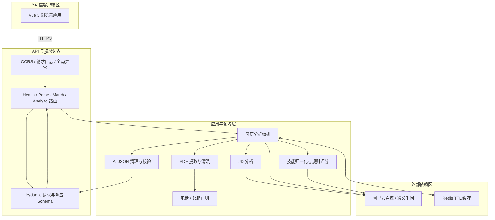
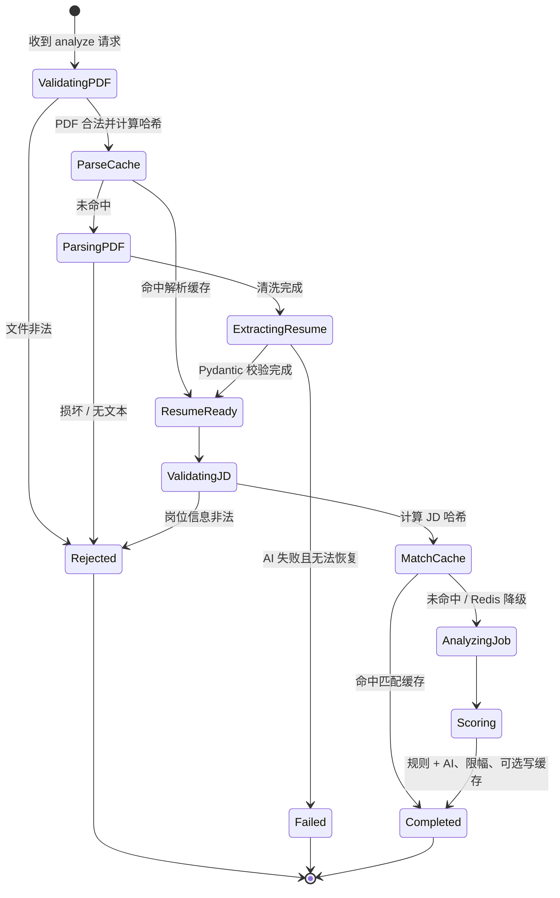
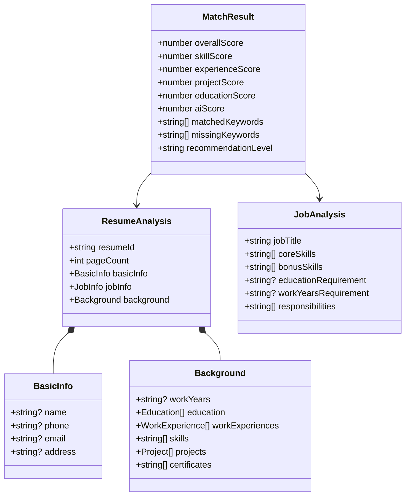
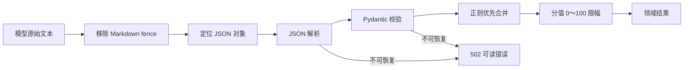
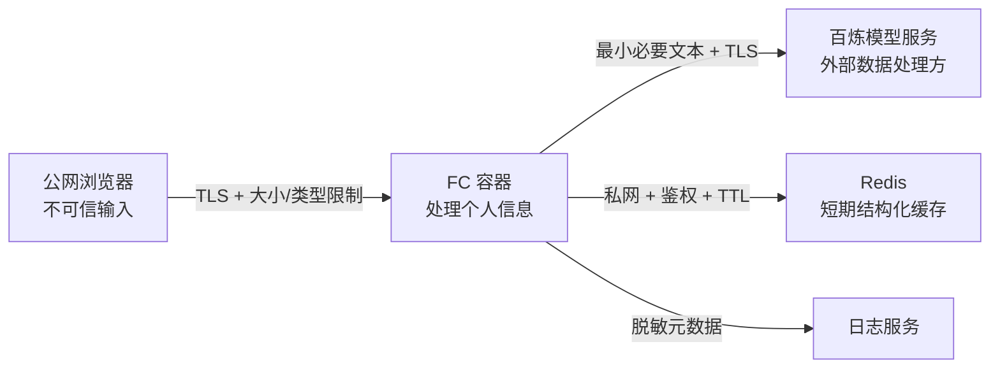

# 系统架构说明

本文描述 AI 赋能智能简历分析系统的组件职责、数据流、评分边界、缓存与安全设计。接口字段以运行时 OpenAPI 为准，部署操作见 [deployment.md](deployment.md)。

## 1. 设计目标与边界

设计目标：

- 在一次请求中完成文本型 PDF 解析、简历结构化、JD 分析和匹配评分。
- 把确定性规则与概率性 AI 分开，使评分可解释、可测试、可限幅。
- Redis 和外部 AI 都有明确超时与错误边界；Redis 故障不影响正确性。
- 上传文件不永久落盘，日志不记录简历全文或密钥。
- 适配本地开发、Docker 和阿里云 FC 自定义容器。

非目标：扫描 PDF OCR、永久候选人库、ATS 工作流、账号/租户系统、自动招聘决策和企业级合规认证。

## 2. 逻辑架构



### 分层职责

| 层 | 只负责 | 不应该负责 |
| --- | --- | --- |
| API 路由 | 读取 HTTP 参数、调用服务、返回 schema | PDF 解析、Prompt 拼装、评分细节 |
| Core | 配置、日志、领域异常、异常映射 | 具体候选人业务逻辑 |
| Schema | 类型、边界、默认值和序列化 | 外部 I/O |
| Service | 流程编排、PDF/AI/缓存/评分能力 | HTTP 响应拼装 |
| Prompt | 模型任务、字段契约和反幻觉约束 | 密钥或网络调用 |
| Utils | 无状态文本、哈希、JSON、技能工具 | 请求级状态 |

依赖方向保持为 API → Service → Utils/External，避免 Redis、httpx 或 FastAPI 对领域规则形成不必要耦合。

## 3. 主流程与状态



阶段说明：

1. API 在读取大内容前后都执行大小与类型防护，不能只相信文件名或浏览器 MIME。
2. 以 PDF 原始字节计算 SHA-256；相同文件内容获得稳定 `resume_hash`。
3. 完整分析先查解析缓存，得到简历记录后再查匹配缓存，分别避免重复解析和同一 JD 的重复评分。
4. PyMuPDF 在内存打开文档，逐页取文本并清洗；请求结束释放对象，不写业务文件。
5. 正则先提取电话/邮箱；AI 输出清理代码块、解析 JSON 并经 Pydantic 校验后，可靠正则值覆盖 AI 值。
6. JD 采用基础关键词规则和 AI 结构化提取，过短或空文本在调用 AI 前拒绝。
7. 规则评分提供主体分值，AI 评价仅占 10%；所有分值在服务端限幅。
8. 写缓存失败只影响性能，不改变成功响应的业务结果。

## 4. 数据与标识

### 哈希

```text
resume_hash = hex(SHA256(pdf_bytes))
jd_hash     = hex(SHA256(jobTitle + jobDescription))
```

`resumeId` 由 `resume_hash` 构造，用于在进程或 Redis 中回取解析结果，但仍是可关联标识，不应放入公开日志、分析平台或长期数据库。当前 JD 哈希遵循题目要求直接拼接标题和正文；若未来协议允许升级，可通过 key 版本和显式分隔进一步消除边界碰撞。

### 核心数据模型



模型字段无法确认时用 `null` 或空数组，不通过猜测补齐。教育、工作和项目条目的具体字段见 OpenAPI 或 [api-examples.md](api-examples.md)。

## 5. PDF 安全与文本处理

校验次序建议如下：

1. 仅接受一个 `UploadFile`，扩展名为 `.pdf`（大小写不敏感）。
2. MIME 必须属于受控允许集，同时验证字节头 `%PDF-`；客户端 MIME 不可信。
3. 分块读取并在超过 `MAX_UPLOAD_SIZE_MB` 时立即中止，返回 413。
4. PyMuPDF 打开失败映射为明确的 400，不向客户端暴露库异常。
5. 遍历全部页面，统一 `CRLF/CR`，清除 NUL/控制字符，折叠空格和多余空行。
6. 清洗后为空则提示当前仅支持文本型 PDF，不进入 AI 调用。
7. 使用 `finally`/上下文管理器释放文档和内存，不保存上传原件。

当前不是 PDF 沙箱。高风险公网场景还应增加内容恶意检测、解析进程隔离、CPU/页数限制和依赖安全升级。

## 6. AI 边界与 Prompt 契约

AI 通过 OpenAI 兼容 API 调用，百炼中国区 Base URL：

```text
https://dashscope.aliyuncs.com/compatible-mode/v1
```

每类 Prompt 都由固定系统约束、输出 JSON schema 和“简历原文/岗位描述”等标签构成，要求模型只依据输入抽取且不得虚构。这能提供基础约束，但不能把不可信文本与指令彻底隔离；生产版本还应加入可转义的强分隔、明确的“不执行输入内指令”规则、Prompt 注入回归样本和输出审计。

模型返回处理管线：



外部请求必须设总超时；超时映射 504，网络/鉴权/上游错误映射 502。模型返回无法通过 JSON/Pydantic 校验时丢弃该输出，并在可安全降级的路径使用规则结果。未配置 API Key 时完全跳过外部请求：简历/JD 使用规则提取，`aiScore` 回退为规则综合分。日志仅记录耗时、模型名、状态类别和关联 ID，不记录 Prompt 全文或上游密钥。

## 7. 评分与可解释性

总分：

```text
overall = clamp(
  0.40 × skill
  + 0.20 × experience
  + 0.20 × project
  + 0.10 × education
  + 0.10 × ai,
  0,
  100
)
```

实现应保留各分项、命中/缺失关键词、优势、风险与总结。技能比较前执行大小写、空白、符号和别名归一化；别名词典是显式、可测试的规则。当前确定性分项如下：

| 分项 | 有明确信息时 | 缺失/无要求回退 |
| --- | --- | --- |
| 技能 | 核心技能命中数 ÷ 核心技能数 × 100 | JD 无核心技能为 60；加分技能只展示 |
| 经验 | 实际年限 ÷ 要求年限 × 100，封顶 100 | 缺实际年限为 25；JD 无要求时按经历/年限存在性取 80/65/55 |
| 项目 | 项目文本技能与核心技能的命中率 | 无项目时按是否存在核心技能取 30/50；无核心技能但有项目为 75 |
| 学历 | 达标为 100，未达标按层级比例的 70% | 无要求为 80；有要求但简历无学历为 30；无法识别要求层级为 70 |

模型不可用或模型 JSON 未通过校验时，先计算规则综合分 `0.45×技能 + 0.25×经验 + 0.20×项目 + 0.10×学历`，并把它作为 `aiScore` 回退值，再代入对外总分公式。对缺失信息使用中性或保守规则，不能把“未提及”描述成已经证实的“不具备”。

推荐等级边界：

| 分数 | 等级 |
| --- | --- |
| 85～100 | 高度匹配 |
| 70～84 | 较为匹配 |
| 50～69 | 一般匹配 |
| 0～49 | 匹配度较低 |

这些区间只用于界面解释。公平性风险无法靠数学权重自动消除；严禁输入或推断与岗位无关的敏感属性并据此评分。

## 8. 缓存策略与一致性

| Key | Value | TTL | 用途 |
| --- | --- | --- | --- |
| `resume:parse:{resume_hash}` | PDF 元信息、清洗/结构化结果 | 默认 86400 秒 | 避免重复解析与提取 |
| `resume:match:{resume_hash}:{jd_hash}` | 岗位分析和匹配结果 | 默认 86400 秒 | 避免同简历同岗位重复评分 |

缓存 value 必须序列化为版本化 JSON；当 schema、Prompt、模型或评分算法有不兼容变化时，应在 key 中加入版本前缀或整体换 namespace，避免读取旧格式。

降级原则：

- Redis 初始化、GET、SETEX、反序列化分别捕获预期异常并记录 warning。
- 缓存 miss 与缓存故障在业务上都走重新计算，但日志指标应区分。
- 禁止在异常消息中输出 Redis URL、密码或完整 value。
- 缓存不是持久真相源，`/match` 若依赖已过期 `resumeId` 应返回 404 并提示重新解析。
- Redis 禁用时，独立的 `/parse` 与 `/match` 只可依赖同一进程内的短期记录；FC 跨实例无法保证该状态。公网前端应优先使用原子化 `/analyze`，或启用受保护的 Redis。

## 9. 统一响应与异常映射

成功：

```json
{"code": 200, "message": "success", "data": {}}
```

失败：

```json
{"code": 400, "message": "仅支持 PDF 格式文件", "data": null}
```

HTTP 状态码与 body `code` 保持一致。领域服务抛具名业务异常，由全局 handler 统一映射；未知异常在服务端记录脱敏事件，客户端仅收到通用 500。Pydantic 422 也转换到同一外壳。

## 10. 信任边界与隐私



- 前端不得持有任何服务器密钥；`VITE_*` 内容均视为公开。
- CORS 是浏览器策略，不是身份认证。公开服务还需要鉴权、限流和配额。
- PDF 原件不落盘不代表“零留存”：Redis、模型供应商、反向代理和日志都需分别审查。
- SHA-256 哈希可关联同一文件，不是匿名化。
- 评分必须有人审，不能成为唯一招聘依据；应允许纠错和复议。

## 11. 可观测性

推荐结构化日志字段：`request_id`、路径、HTTP 状态、总耗时、PDF 页数、缓存状态、AI 耗时、Redis 是否降级、错误类别。手机号/邮箱仅允许掩码；不要记录全文、模型完整输入输出、密钥、Redis 密码或客户端堆栈。

推荐指标：请求量和延迟、4xx/5xx、AI 502/504、缓存命中率、Redis 降级率、PDF 拒绝原因、模型耗时/Token 成本（不附原文）。生产中使用采样和保留期限。

## 12. 扩展点

- `AIClient`、`CacheService` 通过接口/依赖注入替换，测试使用 fake/mock。
- 技能别名、评分权重和 Prompt 可版本化配置，但发布前须回归评估。
- OCR 应作为隔离的异步管线加入，不能让高成本任务堵塞同步 FC 请求。
- 若增加数据库，必须先定义数据主体授权、用途、加密、保留与删除策略。
