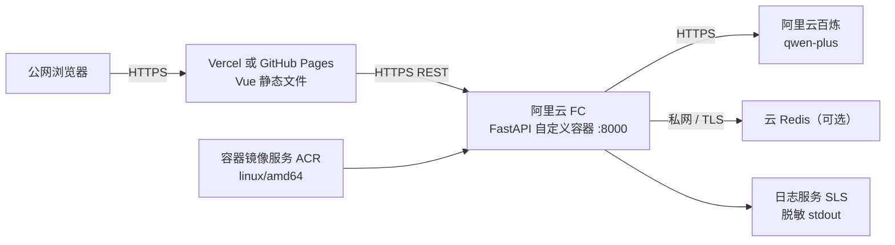

# 部署与运维手册

本文给出本地、Docker、阿里云函数计算 FC、Vercel 和 GitHub Pages 的可执行部署路径。仓库中的域名、账号、地域和镜像地址都是占位符；文档不表示任何真实云资源已经创建或上线。

## 1. 部署拓扑



推荐先本地测试，再验证镜像，随后部署 FC，最后部署前端并收紧 CORS。静态前端不能隐藏密钥；所有 AI/Redis 凭据只进入后端环境变量。

## 2. 前置准备

- Python 3.10+（推荐 3.11/3.12）、Node.js 18+（推荐 20）、npm。
- Docker Engine / Docker Desktop 和 Compose v2。
- 阿里云账号；开通函数计算 FC、容器镜像服务 ACR、日志服务 SLS 和百炼。若启用云缓存，准备同地域、网络可达的 Redis。
- 一个百炼 API Key；建议为本应用创建独立业务空间/最小模型权限和费用告警。
- Vercel 账号或已开启 Pages 的 GitHub 仓库。
- 已取得测试简历主体授权；联调使用脱敏样本。

生产发布前先决定：服务地域、数据处理与保留规则、是否允许 Redis 缓存个人信息、访问控制/限流方式、人工复核与删除流程。

## 3. 本地直接启动

### 3.1 后端

```bash
cd backend
python -m venv .venv
```

激活虚拟环境：

```bash
# macOS / Linux
source .venv/bin/activate

# Windows PowerShell
.venv\Scripts\Activate.ps1
```

安装、配置并启动：

```bash
python -m pip install --upgrade pip
python -m pip install -r requirements.txt
cp .env.example .env
uvicorn app.main:app --reload --host 0.0.0.0 --port 8000
```

Windows 可用 `Copy-Item .env.example .env`。至少将 `.env` 中的 `DASHSCOPE_API_KEY` 改为有效 Key；若本机未运行 Redis，设 `REDIS_ENABLED=false`。

### 3.2 前端

```bash
cd frontend
cp .env.example .env
npm install
npm run dev
```

前端 `.env`：

```env
VITE_API_BASE_URL=http://localhost:8000
```

访问 `http://localhost:5173`，验证 `http://localhost:8000/api/health`。`.env` 不可提交。

## 4. Docker Compose

根目录 Compose 启动 FastAPI 与 Redis。它不会启动前端，前端开发服务器按上一节运行。

在仓库根目录创建 `.env`：

```env
DASHSCOPE_API_KEY=replace_with_your_key
DASHSCOPE_MODEL=qwen-plus
CORS_ORIGINS=http://localhost:5173
```

配置检查与启动：

```bash
docker compose config
docker compose up --build
```

检查：

```bash
curl http://localhost:8000/api/health
docker compose ps
docker compose logs --tail=100 backend
```

停止：

```bash
docker compose down
```

Compose 中 Redis 禁用了 RDB/AOF，不把简历缓存写入本地磁盘。它仍会在内存中保留结构化结果直到 TTL 或容器销毁；需要完全禁用缓存时设置 `REDIS_ENABLED=false`。不要把真实 Key 写进 `docker-compose.yml` 或镜像层。

## 5. 发布前验证

```bash
cd backend
pytest

cd ../frontend
npm install
npm test
npm run build

cd ..
docker compose config
docker compose build
```

确认生产构建不含 `localhost`、`.env`、真实简历或密钥。还要手工覆盖合法 PDF、伪/损坏/空文本/超限 PDF、空 JD、缓存命中和 Redis 降级。

## 6. 阿里云 FC 自定义容器

### 6.1 创建 ACR 仓库

1. 在容器镜像服务控制台创建命名空间和镜像仓库，例如 `resume/ai-resume-analyzer-backend`。
2. ACR 与 FC 选择同一账号、同一地域；私有镜像使用 FC 服务角色授权拉取。
3. 记录控制台给出的 Registry 域名和登录命令。以下命令用占位符表示：

```bash
export ACR_REGISTRY=<registry-domain>
export ACR_NAMESPACE=<namespace>
export IMAGE_NAME=ai-resume-analyzer-backend
export IMAGE_TAG=<immutable-version-or-git-sha>
```

PowerShell 可设置 `$env:ACR_REGISTRY` 等同名变量。不要长期复用 `latest`；使用版本号或 Git SHA 才能审计和回滚。

### 6.2 构建并推送镜像

FC 自定义镜像当前要求与函数支持架构一致；官方文档说明为 AMD64，因此在 ARM 电脑上显式指定平台：

```bash
docker build --platform linux/amd64 \
  -t "$ACR_REGISTRY/$ACR_NAMESPACE/$IMAGE_NAME:$IMAGE_TAG" \
  ./backend

docker run --rm -p 8000:8000 \
  -e PORT=8000 \
  -e REDIS_ENABLED=false \
  -e DASHSCOPE_API_KEY="$DASHSCOPE_API_KEY" \
  "$ACR_REGISTRY/$ACR_NAMESPACE/$IMAGE_NAME:$IMAGE_TAG"
```

另开终端执行 `curl http://localhost:8000/api/health`。通过后登录并推送：

```bash
docker login "$ACR_REGISTRY"
docker push "$ACR_REGISTRY/$ACR_NAMESPACE/$IMAGE_NAME:$IMAGE_TAG"
```

登录方式和 Registry 域名以 ACR 控制台生成的命令为准。不要把登录密码放进脚本或 shell 历史。

### 6.3 创建 FC 应用/函数

阿里云控制台界面名称可能调整，核心配置如下：

1. 进入函数计算，选择与 ACR 相同地域。
2. 创建应用或 Web 函数，运行环境选择“自定义容器/容器镜像”。若从应用模板进入，仍需确认最终资源是自定义镜像 Web 函数。
3. 镜像选择上一节推送的不可变 tag；私有仓库按向导授予 FC 服务角色拉取权限。
4. 容器启动命令默认沿用 Dockerfile。若控制台覆盖 Command/Args，必须与 Dockerfile 启动 FastAPI 的方式一致。
5. 将自定义容器端口（`CAPort`/监听端口）设为 `8000`，并设置环境变量 `PORT=8000`。应用必须监听 `0.0.0.0:8000`，不能只监听 `127.0.0.1`。
6. 官方默认 CAPort 可能显示 `9000`，但本项目统一使用 `8000`；二者不一致会导致启动探测失败。
7. 初始可选择至少 1 GB 内存并给 AI 调用留出足够超时时间，再根据 PDF 大小、并发和监控调整。函数超时应大于 `DASHSCOPE_TIMEOUT` 与 PDF 处理耗时之和。
8. 如启用云 Redis，为函数配置能访问 Redis 的 VPC/交换机/安全组；`REDIS_HOST` 不能写 `localhost`。网络不通时应用会降级，但模型调用量和延迟会上升。
9. 配置日志服务项目/Logstore。容器 stdout/stderr 由 FC 收集；应用日志必须脱敏。

不要依赖容器可写层保存数据：实例回收后会丢失。本项目不需要持久本地磁盘。

### 6.4 FC 环境变量

推荐配置：

```env
APP_NAME=AI Resume Analyzer
APP_ENV=production
DEBUG=false
PORT=8000

DASHSCOPE_API_KEY=<set-in-console-or-secret-manager>
DASHSCOPE_MODEL=qwen-plus
DASHSCOPE_TIMEOUT=60
DASHSCOPE_BASE_URL=https://dashscope.aliyuncs.com/compatible-mode/v1/chat/completions

REDIS_ENABLED=true
REDIS_HOST=<private-redis-host>
REDIS_PORT=6379
REDIS_PASSWORD=<set-securely>
REDIS_DB=0
REDIS_TTL=86400

MAX_UPLOAD_SIZE_MB=10
MAX_PDF_PAGES=50
RETURN_CLEANED_TEXT=false
CORS_ORIGINS=https://<your-vercel-domain>,https://<account>.github.io
```

变量的精确解析格式以 `backend/.env.example` 为准。如果不使用 Redis，设 `REDIS_ENABLED=false` 并省略 Redis 密码。百炼中国大陆 OpenAI 兼容 Base URL 是：

```text
https://dashscope.aliyuncs.com/compatible-mode/v1
```

本项目通过 httpx 直接 POST，因此 `DASHSCOPE_BASE_URL` 配置的是追加了 `/chat/completions` 的完整接口地址。API Key 必须与所选地域/业务空间和模型权限匹配，不要把 URL 误当作 Key。

### 6.5 开启公网访问

1. 为 Web 函数创建 HTTP 触发器或 Web Endpoint，并选择公网访问。
2. 公开演示若使用匿名访问，任何人都可能触发付费 AI 调用；至少配置网关/WAF 限流、上传限制、费用告警和并发上限。生产优先接入身份认证。
3. 获得 FC HTTPS 公网域名，例如 `https://<function-domain>`。
4. 先只测试 `GET /api/health`，再使用授权脱敏 PDF 测试 `/api/resumes/analyze`。
5. 把实际前端 Origin 精确加入 `CORS_ORIGINS`。Origin 不含路径，通常也不带末尾 `/`；不要在公网生产使用 `*` 搭配凭证。

### 6.6 健康检查和日志

```bash
curl -i https://<function-domain>/api/health
```

预期 HTTP 200 和统一 JSON。若超时，依次检查：镜像架构、镜像拉取权限、Command/Args、`PORT`/CAPort 是否都为 8000、是否监听 `0.0.0.0`、启动是否在平台限制内。

在函数详情的“日志/调用日志”或关联 SLS Logstore 中按请求 ID、状态码和时间查询。允许记录路径、耗时、页数、缓存状态、AI 耗时、Redis 降级和错误类别；禁止记录完整简历、完整电话/邮箱、Prompt 全文、API Key、Redis 密码和上游原始响应。

### 6.7 更新与回滚

每次发布构建新 tag，推送后创建新函数版本/更新镜像并做灰度或最小流量验证。至少验证健康、PDF 负例、AI 502/504 和 Redis 降级。回滚时将函数恢复到上一已验收镜像 tag；不要重新推送覆盖旧 tag。

## 7. Vercel 部署前端

### 7.1 导入项目

1. 将仓库推送到 GitHub，但先确认不含 `.env`、密钥或真实简历。
2. 在 Vercel 新建项目并导入仓库。
3. Framework Preset 选择 Vite（通常自动识别）。
4. Root Directory 设为 `frontend`。
5. Install Command 使用 `npm install` 或锁文件存在时使用 `npm ci`；Build Command 为 `npm run build`；Output Directory 为 `dist`。

### 7.2 配置生产变量

在 Production（需要时同时配置 Preview）环境添加：

```env
VITE_API_BASE_URL=https://<function-domain>
```

该 URL 必须为公网 HTTPS 且不应写死 localhost。`VITE_*` 会公开到浏览器，不能放 `DASHSCOPE_API_KEY`、Redis 密码或任何秘密。

### 7.3 SPA 刷新回退

Vite SPA 的深链默认不会自动回退。`frontend/vercel.json` 应包含：

```json
{
  "$schema": "https://openapi.vercel.sh/vercel.json",
  "rewrites": [
    {"source": "/(.*)", "destination": "/index.html"}
  ]
}
```

Vercel 项目的 Root Directory 是 `frontend`，因此该文件位于 Vercel 所见项目根。部署后访问首页并直接刷新任意前端路由，确认没有 404。

### 7.4 联调与 CORS

1. 首次部署得到 `https://<project>.vercel.app`。
2. 将这个 Origin 加到 FC 的 `CORS_ORIGINS` 并重新发布后端。
3. 在浏览器 Network 面板确认请求发送到 FC HTTPS 域名，预检 OPTIONS 成功。
4. 使用授权脱敏样本测试成功、参数错误、上游失败和移动端布局。
5. Preview 域名可能动态变化；不要因此在生产开放任意 Origin。可使用稳定预览域名、受控正则策略或只允许 production 域名。

## 8. GitHub Pages 备用部署

### 8.1 注意事项

- 项目站点通常部署在 `https://<account>.github.io/<repository>/`，构建时 Vite `base` 必须是 `/<repository>/`。
- `VITE_API_BASE_URL` 必须指向 FC HTTPS 地址；Pages HTTPS 不能调用 HTTP API。
- 若引入 Vue Router history 模式，需提供 Pages 404 回退或改用 hash 模式，并实测深链刷新。
- 在仓库 Settings → Pages → Build and deployment 中选择 GitHub Actions。

### 8.2 官方 Pages Actions 工作流

仓库已提供 [`.github/workflows/pages.yml`](../.github/workflows/pages.yml)。以下配置与仓库工作流一致，使用官方 `configure-pages`、`upload-pages-artifact`、`deploy-pages` Actions，并在发布前执行前端测试：

```yaml
name: Deploy frontend to GitHub Pages

on:
  push:
    branches: [main]
  workflow_dispatch:

permissions:
  contents: read
  pages: write
  id-token: write

concurrency:
  group: pages
  cancel-in-progress: false

jobs:
  build:
    runs-on: ubuntu-latest
    steps:
      - uses: actions/checkout@v4
      - uses: actions/setup-node@v4
        with:
          node-version: "20"
          cache: npm
          cache-dependency-path: frontend/package-lock.json
      - uses: actions/configure-pages@v5
      - name: Validate API URL
        run: |
          [[ -n "${VITE_API_BASE_URL}" && "${VITE_API_BASE_URL}" == https://* ]]
      - name: Install
        working-directory: frontend
        run: npm ci
      - name: Test
        working-directory: frontend
        run: npm test
      - name: Build
        working-directory: frontend
        env:
          VITE_API_BASE_URL: ${{ vars.VITE_API_BASE_URL }}
          VITE_BASE_PATH: /${{ github.event.repository.name }}/
        run: npm run build
      - uses: actions/upload-pages-artifact@v3
        with:
          path: frontend/dist

  deploy:
    needs: build
    runs-on: ubuntu-latest
    environment:
      name: github-pages
      url: ${{ steps.deployment.outputs.page_url }}
    steps:
      - name: Deploy
        id: deployment
        uses: actions/deploy-pages@v4
```

在 Settings → Secrets and variables → Actions → Variables 添加公开变量 `VITE_API_BASE_URL=https://<function-domain>`。实际仓库工作流会在变量缺失或不是 HTTPS 时 fail-fast，避免发布只能错误请求同源 Pages 的不可用页面。API 地址本身不是秘密；真正的 Key 永远不能进入 Pages 构建。

### 8.3 Pages 验收

1. Actions 的 build 和 deploy job 均成功。
2. 部署 URL 的 HTML、JS、CSS 资源没有 404，路径包含正确仓库 base。
3. 浏览器请求指向 FC HTTPS，且 FC CORS 包含 `https://<account>.github.io`。
4. 上传分析、错误提示、移动端、首页刷新和深链策略均实际验证。

## 9. GitHub 推送

在 GitHub 新建空的公开仓库后，从项目根目录执行：

```bash
git init
git add .
git status
git commit -m "feat: deliver AI resume analyzer"
git branch -M main
git remote add origin https://github.com/<your-account>/ai-resume-analyzer.git
git push -u origin main
```

推送前必须确认：

```bash
git status --short
git ls-files | grep -E '(^|/)\.env$|\.pem$|\.key$|resume.*\.pdf$'
```

Windows 没有 `grep` 时使用 `git ls-files | Select-String -Pattern '(^|/)\.env$|\.pem$|\.key$|resume.*\.pdf$'`。匹配到文件时逐项核验，不要提交真实密钥或简历。若仓库已有历史，先检查 `git remote -v` 和分支保护，不要强推覆盖。

## 10. 生产安全基线

- FC、ACR、Redis、百炼尽量同地域；使用最小权限 RAM 角色和独立 API Key。
- 公网只开放 HTTPS；加认证、限流、并发/费用告警和请求体大小限制。
- Redis 走私网，启用鉴权/TLS（能力允许时），TTL 最小化；不允许缓存时完全关闭。
- `DEBUG=false`、`RETURN_CLEANED_TEXT=false`，CORS 使用精确白名单。
- 日志脱敏并设置短保留期；禁止记录简历全文、完整联系方式和模型完整输入输出。
- 固定依赖与镜像版本，执行依赖/镜像/Secret 扫描，定期更新基础镜像。
- 对候选人说明 AI 数据处理和评分用途，提供人工复核、纠错和删除机制。
- 评分不得作为唯一招聘依据，不得基于与岗位无关的敏感属性决策。

## 11. 最终部署验收

- [ ] 本地 `pytest`、`npm test` 和 `npm run build` 成功，真实 AI 在单元测试中被 Mock。
- [ ] `docker compose config`、镜像构建和本地容器健康检查成功。
- [ ] ACR 镜像为 linux/amd64、不可变 tag，且不含 `.env`/密钥/简历。
- [ ] FC 服务监听 `0.0.0.0:8000`，CAPort 和 `PORT` 都是 8000。
- [ ] FC 环境变量齐全，公网健康检查返回 200，SLS 日志不含敏感信息。
- [ ] Redis 故障时主流程降级，缓存命中时结果正确；合规策略允许当前 TTL。
- [ ] Vercel/Pages 使用生产 `VITE_API_BASE_URL`，构建产物无 localhost 或秘密。
- [ ] CORS 只允许实际前端域名，浏览器预检和完整分析成功。
- [ ] 非 PDF、超限、损坏、空文本、空 JD、AI 超时等错误不泄露内部堆栈。
- [ ] 公网已设置认证/限流/费用告警，招聘结论保留人工复核。
- [ ] README 中占位 URL 仅在真实验收后替换，不把“构建成功”描述为“已部署”。

## 12. 常见故障

| 现象 | 优先检查 |
| --- | --- |
| FC `FunctionNotStarted` / 健康超时 | AMD64 镜像；CAPort=`8000`；`PORT=8000`；监听 `0.0.0.0`；Command/Args |
| FC 拉取镜像失败 | ACR/FC 地域、仓库版本、服务角色和镜像 tag |
| 浏览器 CORS 错误 | `CORS_ORIGINS` 是精确 Origin；OPTIONS；后端是否已重新发布 |
| 浏览器 mixed content | 前端与 API 都必须使用 HTTPS |
| Vercel 刷新 404 | Root Directory、`frontend/vercel.json` rewrite |
| Pages 资源 404 | Vite `base` 是否为 `/<repository>/`，artifact 是否为 `frontend/dist` |
| AI 401/403 | Key 地域/业务空间、模型授权、变量是否注入；不要打印 Key |
| AI 504 | `DASHSCOPE_TIMEOUT`、FC 函数超时、模型/网络耗时和输入长度 |
| Redis 一直降级 | VPC/安全组/DNS/端口/TLS/密码；`REDIS_HOST` 不能是 localhost |
| 二次调用未命中 | Redis 是否启用、TTL、PDF 字节和 JD 是否完全一致、key/schema 版本 |

## 官方参考

- [阿里云函数计算：自定义镜像（Custom Container）](https://help.aliyun.com/zh/functioncompute/fc/custom-container/)
- [阿里云百炼：子业务空间的模型调用（含 OpenAI 兼容地址）](https://help.aliyun.com/zh/model-studio/model-calling-in-sub-workspace)
- [Vercel：Vite 部署与 SPA rewrite](https://vercel.com/docs/frameworks/frontend/vite)
- [GitHub Pages：使用自定义 GitHub Actions 工作流](https://docs.github.com/en/pages/getting-started-with-github-pages/using-custom-workflows-with-github-pages)
